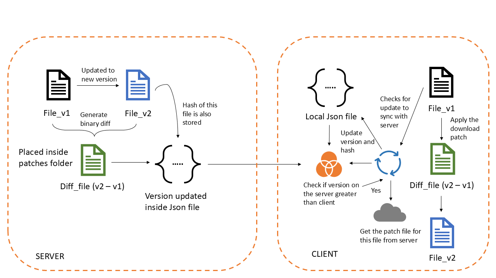

# Update-Architecture-For-Applications
## Overview
This project deals with designing the basic architecture for updating an application.

## High-Level Design

## Features
### Server
- Capability to add new file and generate binary diff files for existing files if updated!
- Send full fill in case client detects corruption and needs to get repaired.
- Binary diff is generated by akdelta file in utils folder.

### Client
- Has UI projecting different buttons - "Check for Updates", "Download Patches", "Apply Patches", "Check for corruption", "Repair Corruption".
  
### Corruption Repair
Client detects corruption repair via matching hash of the file and the hash stored in the client's version.json, if hash does not match then our file is corrupted.
